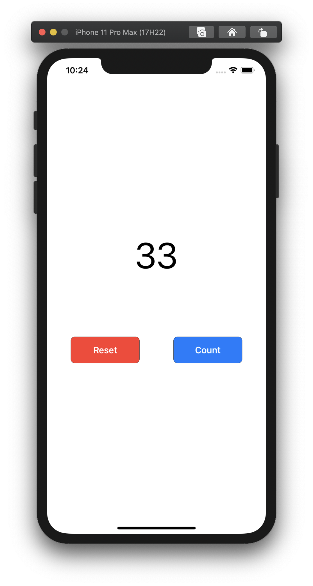

# SwiftUI-CounterApp

Create a simple Counter App in SwiftUI. 

You will learn about `VStack`, `HStack` and `@State` property wrapper.

Inline-style: 

Visit our YouTube video, 
[SwiftUI Counter App](https://youtu.be/v04VfP1rOoA)

YouTube channel
[learnmake.app](https://www.youtube.com/channel/UC7CAmna4bcOtl1tCfsVHjCQ)

Visit our website, 
[learnmake.app](https://learnmake.app)
